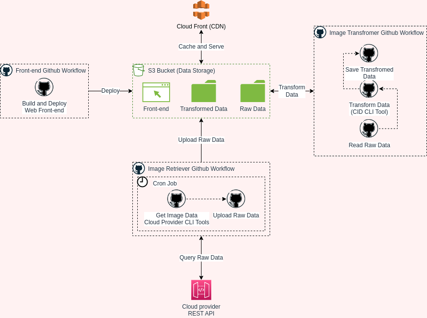

# Cloud Image Directory

This is an experimental project and a work in progress with the goal of making it easier
to find Red Hat Enterprise Linux™, Fedora and, in the future, a bunch of other linux images
at various public cloud providers.

## Components

This repository contains the tool `cloudimagedirectory-transformer`, which is used to transform the unstructured data provided by `cloud-image-retriever` into a predefined schema for the `directory-frontend`.

It belongs to three other sub projects.

- [cloud-image-retriever](https://github.com/redhatcloudx/cloud-image-retriever): Used to retrieve unstructured image data from public cloud providers.
- [infrastructure](https://github.com/redhatcloudx/infrastructure): Defines the public cloud infrastructure [imagedirectory.cloud](https://imagedirectory.cloud/).
- [directory-frontend](https://github.com/redhatcloudx/cloud-image-directory-frontend) Used to visualize the dataset.

### Architecture diagram



The Collector(`cloud-image-retriever`) fetches the images from different cloud providers on a predefined interval. This data is then stored in a s3 bucket.
After a successful collection, the transformer(`cloudimagedirectory-transformer`) reads the unstructured image data from the S3 bucket and generates static image content in a consumable format. The transformer generates also lookup tables to allow an efficient search from e.g. a js single page application. Once the transformation is complete, it's written back into the s3 bucket.
In parallel frontend code is deployed by putting it into the s3 bucket too. This can be done by a [release pipeline](https://github.com/redhatcloudx/cloud-image-directory-frontend/blob/main/.github/workflows/release.yaml).
Finally the S3 bucket gets synchronized with the CDN provider in a reasonable interval.

## Development guide

[Poetry] is used for dependency management and centralized configuration for testing and
linting tools. Start by [installing poetry] and then clone the repository.

After cloning, run the following:

```console
poetry install
```

Pre-commit hooks are used to ensure that code passes the linter checks before you push.
Prepare the pre-commit hooks on your computer by running some commands:

```console
poetry run pre-commit install
poetry run pre-commit run --all-files
```

You can quickly run tests with `poetry run pytest` or run the full pre-commit suite with
`poetry run pre-commit run --all-files`. Or, simply start a commit (such as `git commit -m "Fixed the bug"`) and the pre-commit checks run automatically.

If you need to add more Python packages to poetry, run the following:

```console
# For packages that this project requires in production
poetry add foo

# For packages that are only needed for linting, testing, or development work
poetry add --group dev bar
```

## Running tests

Use poetry to run pytest:

```commandline
# Run all tests, including end-to-end tests that call out to cloud APIs:
poetry run pytest
```

[Poetry]: https://python-poetry.org/
[installing poetry]: https://python-poetry.org/docs/#installation
